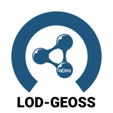
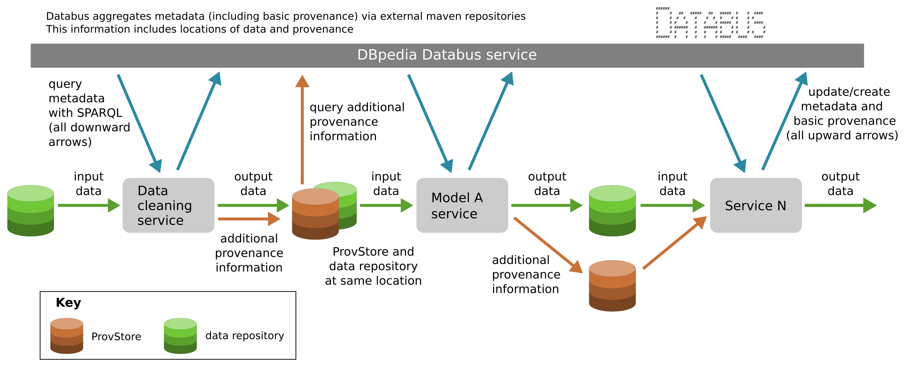
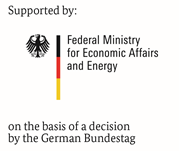

# LOD-GEOSS.github.io
## Using Linked Open Data and the Global Earth Observation Systems of System in Energy Systems Analysis

[https://lod-geoss.github.io/](https://lod-geoss.github.io/) is the open dissemination channel for the LOD-GEOSS project. 

## Content
### Challenges

Modeling in energy systems analysis needs a lot of data from a variety of different sources: 
* Meteorological time series for renewable power generation, 
* Electricity demand from the transparency platforms, 
* Technology data, 
* Socio economic data, 
* Geographical land use data, 
* etc. 
There are a lot different sources available, but they are sometimes hard to find and each has different ways of accessing the data and different ways how data fields are defined. 

### Learning from Earth Observation and Linked Open Data
Similar problems arose in earth observation about two decades ago. The answer was the development of a distributed data infrastructure for Earth Observation data, the Global Earth Observation Systems of Systems (GEOSS). Data could be found through data catalogs, where providers registered their metadata and ways of data access could be discovered though standardized interface descriptions as e.g. WSDL (Web Service Description Language). 
As the data stayed within the hosting institutions, these institutions stay responsible for the data and data maintenance, which eases legal questions and updates of the data. The idea is the development of a networked data base concept based on the ideas of linked open data and the semantic web for input and output data of energy system models in energy systems analysis. 

### Development of a Distributed Data Architecture

Based on the [DBpedia Databus](https://databus.dbpedia.org/about) we want to create an infrastructure to share data in the domain of energy systems analysis. The idea is to share the metadata on the Databus which contains links to the acutual repositories of the shared data. The databus creates a persistent data id which can be used to link data sets. These will be enriched by provenance information, which tracks the information who has been modifying or creating the data by which tools. In the end, all published data should be tracable back to its originating data sets.  

The project keeps its public results in [this Wiki](https://github.com/LOD-GEOSS/LOD-GEOSS.github.io/wiki).

## Project Partners

 

German Aerospac Center, [Institute of Networked Energy Systems](https://www.dlr.de/ve) (Co-ordiination), [Institute of Software Technology](https://www.dlr.de/sc)

 

[Reiner Lemoine Institute](https://www.rl-institut.de)

 

[Leipzig University - Institute of Applied Informatics](https://infai.org)

[Potsdam Insitute for Climate Impact Research](https://www.pik-potsdam.de)

[Forschungszentrum Jülich](https://www.fz-juelich.de)

[Stuttgart University - Institute for Energy Economics and Rational Energy Use](https://www.ier.uni-stuttgart.de/en/)

## Funding

This project is supported by the BMWi - Federal Ministry for Economic Affairs and Energy

Research Grant 03EI1005A-G

## License

* All software in the git repository is licensed under MIT
* All content in the wiki is licensed under CC-BY 4.0
